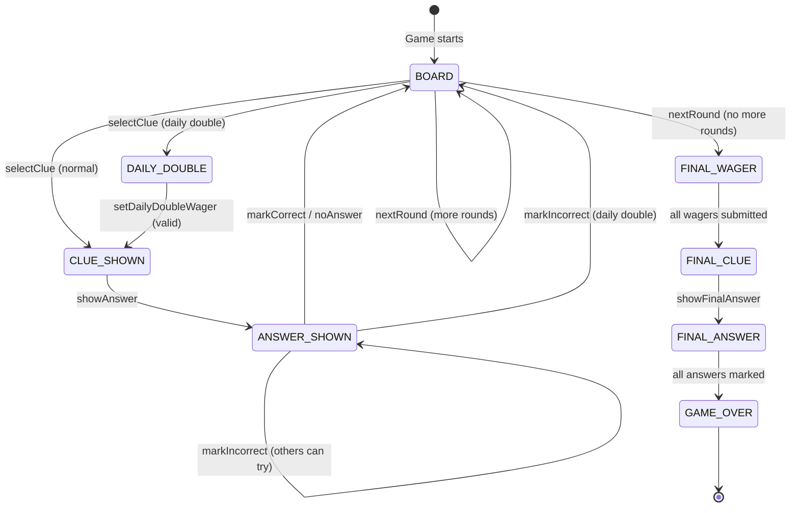

# Standalone Jeopardy Game Website (Bikini Bottom Edition) — Implementation Plan

Build a fully client-side Jeopardy game that loads custom questions from a JSON file and supports score tracking for 2–10 players. No frameworks, no build tools — vanilla HTML, CSS, and JavaScript (ES modules), styled with the **Bikini Bottom / Hallmark** design system. The only external runtime dependency is **DOMPurify** (via CDN) for XSS sanitization of user-uploaded content.

---

## Project Structure

```
project-root/
├── index.html              # Single-page app entry point
├── sw.js                   # Service Worker for offline caching
├── css/
│   └── style.css           # All styling (Bikini Bottom theme, grid, modals, scoreboard, responsive)
├── js/
│   ├── app.js              # Main entry — setup, JSON loading, view transitions, orchestration
│   ├── audio.js            # Web Audio API synthesized sound effects
│   ├── board.js            # Board rendering, clue modal, Daily Double, Final Jeopardy UI
│   ├── game.js             # Core state machine (rounds, scoring, Daily Double, Final Jeopardy)
│   └── players.js          # Player management (add/remove, scores, active player tracking)
├── data/
│   └── questions.json      # Sample question set (user-replaceable, includes media examples)
├── tests/
│   ├── players.test.js     # Unit tests for Players class
│   └── game.test.js        # Unit tests for Game state machine
├── docs/
│   └── implementation_plan.md  # Architectural design & implementation blueprint
└── README.md               # Usage guide, JSON schema reference, customization docs
```

> [!NOTE]
> **External CDN dependency**: DOMPurify is loaded via CDN (`<script>` tag in `index.html`) for sanitizing user-uploaded JSON content before DOM insertion. This is the project's only external runtime dependency beyond Google Fonts.

---

## Design Decisions

| Decision | Choice | Rationale |
|---|---|---|
| **Design Language & Theme** | Bikini Bottom Nautical (`oklch` color space via Hallmark review) | Playful aesthetic with deep lagoon ocean backgrounds, SpongeBob Yellow primary accents with AAA contrast, Patrick Coral for incorrect/destructive actions, Kelp Green for correct answers, Jellyfish Teal category headers, and Tiki Brass porthole borders |
| **Typography** | `Lilita One` (display/headers/scores) + `Plus Jakarta Sans` (body/UI) via Google Fonts | Distinctive, expressive display font paired with an ultra-clean, readable geometric sans for body and clues |
| **Grid size** | Configurable — any number of categories × any number of clues | Board auto-sizes via CSS Grid (`minmax(0, 1fr)`) + CSS custom property `--num-categories` |
| **Turn system** | Host mode — host clicks which player answered, then marks correct/incorrect | Single-screen local play, no real-time buzzer |
| **Audio** | Web Audio API synthesized sounds (no external audio files) | Zero dependencies, instant feedback, lazy AudioContext initialization |
| **Rounds** | Standard: Jeopardy → Double Jeopardy → Final Jeopardy | Classic game flow |
| **Module system** | ES modules (`type="module"`, `import`/`export`) | Modern standard, no bundler needed |
| **Responsiveness & Accessibility** | Hallmark responsive floors (320px–768px), `overflow-x: clip`, `prefers-reduced-motion` | Resilient mobile gameplay without horizontal drift; motion accessibility compliance |
| **Testing** | Vitest (local only, no CI) | Native ES module support, minimal config, fast; run locally via `npx vitest` |
| **Security** | DOMPurify via CDN | Sanitize question/answer text from user-uploaded JSON before DOM insertion to prevent XSS |
| **State Persistence** | Full game state in `localStorage` with Resume/New Game modal | Serialize board, used clues, round, scores; prompt user on reload |
| **Offline** | Service Worker caching static assets | Playable offline after first visit; zero external runtime beyond CDN fonts + DOMPurify |
| **Browser Targets** | Modern evergreen: Chrome 89+, Firefox 88+, Edge 89+, Safari 15.4+ | No polyfills needed; all required APIs are natively supported |

---

## JSON Schema
### Media Extensions
Questions may optionally include an **image** or **video** to enrich the play experience. These properties are ignored by the core logic if absent.

| Property | Type | Purpose | Notes |
|----------|------|---------|-------|
| `image` | `string` | URL to an image displayed with the clue | Shown above the question text in the modal |
| `video` | `object` | Video reference | Requires a `url` and a `segments` map.
| `video.url` | `string` | Source URL (YouTube allowed) | Converted to an iframe or native video element |
| `video.segments` | `object` | Named segments with start/end seconds | Two keys: `question` and `answer` |
| `video.segments.question.start` | `number` | Seconds to start the question clip | If omitted, starts at 0 |
| `video.segments.question.end` | `number` | Seconds to end the question clip | If omitted, plays to end |
| `video.segments.answer.start` | `number` | Seconds to start the answer clip | If omitted, starts at 0 |
| `video.segments.answer.end` | `number` | Seconds to end the answer clip | If omitted, plays to end |

During normalisation, the `app.js` module will attach these media objects to each clue. When the clue modal opens, if `image` is present the image is rendered. If `video` is present, the modal will embed a YouTube player and automatically seek to the `question` segment. When the answer is revealed, the player seeks to the `answer` segment and plays it.

The game accepts two JSON formats. The normalizer in `app.js` converts format B → format A on load.

### Format A (canonical)

```json
{
  "rounds": [
    {
      "name": "Jeopardy",
      "categories": [
        {
          "name": "Science",
          "clues": [
            {
              "value": 200,
              "question": "This force keeps planets in orbit around the sun.",
              "answer": "What is gravity?",
              "isDailyDouble": false,
              /*
               * Optional media property
               *   "image": "url-to-image.jpg",
               *   "video": {
               *     "url": "https://www.youtube.com/watch?v=abcd1234",
               *     "segments": {
               *       "question": { "start": 10, "end": 20 },
               *       "answer":   { "start": 35, "end": 45 }
               *     }
               *   }
               */
            },
            {
              "value": 400,
              "question": "This gas makes up 78% of Earth's atmosphere.",
              "answer": "What is nitrogen?",
              "isDailyDouble": false
            }
          ]
        }
      ]
    },
    {
      "name": "Double Jeopardy",
      "categories": [
        {
          "name": "Technology",
          "clues": [
            {
              "value": 400,
              "question": "...",
              "answer": "...",
              "isDailyDouble": true
            }
          ]
        }
      ]
    }
  ],
  "finalJeopardy": {
    "category": "Space Exploration",
    "question": "Launched in 1990, this observatory was named after the astronomer who confirmed the expanding universe.",
    "answer": "What is the Hubble Space Telescope?"
  }
}
```

### Format B (alternative — auto-normalized on load)

```json
{
  "round1": { "name": "...", "categories": [...] },
  "round2": { "name": "...", "categories": [...] },
  "finalJeopardy": { ... }
}
```

> [!IMPORTANT]
> Both `dailyDouble` and `isDailyDouble` field names must be accepted. The normalizer should convert `dailyDouble` → `isDailyDouble` on every clue object during load.

### Sample Data Requirements

The included `data/questions.json` must contain:
- **Round 1** ("Jeopardy"): 6 categories × 5 clues, values 200/400/600/800/1000, exactly 1 Daily Double
- **Round 2** ("Double Jeopardy"): 6 categories × 5 clues, values 400/800/1200/1600/2000, exactly 2 Daily Doubles (in different categories)
- **Final Jeopardy**: 1 category, 1 question, 1 answer
- All questions must be factually accurate, interesting trivia
- Answers phrased as "What is...?" / "Who is...?"
- **At least 1 clue with an `image` property** (a publicly accessible image URL) to exercise image rendering
- **At least 1 clue with a `video` property** (a YouTube URL with `question` and `answer` segments) to exercise video embedding

## Error Handling
The app should validate the uploaded or fetched JSON against the schema. Invalid entries (e.g., missing required fields, duplicate daily doubles, out‑of‑range clue values) must trigger a user‑friendly modal with a clear error message. If a fetch fails (network error or 404), a fallback message prompts the user to retry or load the default `data/questions.json`.

## Upload UX
* **File size limit** – Reject files larger than 5 MB and display a concise warning.
* **MIME type check** – Accept only `application/json` or `.json` files; otherwise, show an error.
* **Progress feedback** – While parsing large files, display a spinner until the JSON is fully read.

## Testing
Add a `tests/` folder containing unit tests for `players.js` and `game.js` (state transitions, scoring, wager validation, round progression). Use **Vitest** as the test runner — add a minimal `package.json` with `vitest` as a dev dependency and a `"test"` script. Tests run locally via `npm test` or `npx vitest`. No CI pipeline.

## Accessibility
* Use `role="button"` and `aria-label` for all interactive elements.
* Update the score display with `aria-live="polite"` so screen readers announce changes.
* Ensure a logical tab order: Setup → Board → Modals → Scoreboard.
* Provide high‑contrast focus rings (`outline: 3px solid var(--focus-ring)`).

## Keyboard Shortcuts
* **Space / Enter** – Show answer or submit wager.
* **M** – Toggle mute.
* **Arrow keys** – Navigate between clue cells; Enter selects.
* **Esc** – Close any open modal.

## Persisting State
Store the full game state in `localStorage`:
* **Serialized data**: Player list, scores, active player, current round index, used clues map, question data, Daily Double state, and game phase.
* **Save triggers**: Save after every state change (score update, clue used, round transition).
* **Resume flow**: On page load, check for saved state. If found, show a **confirmation modal** with two buttons:
  - **"Resume Game"** — restores the exact board state (round, used clues, scores, active player) and jumps to the correct view.
  - **"New Game"** — clears saved state and shows the normal setup screen.
* **Clear triggers**: Saved state is cleared when the game ends (GAME_OVER) or when the user clicks "Play Again" or "New Game".

## Browser Compatibility
Target modern evergreen browsers: Chrome 89+, Firefox 88+, Edge 89+, Safari 15.4+. No polyfills required — all APIs used (`fetch`, ES modules, `oklch()`, Web Audio, Service Worker) are natively supported.

## Offline Capability
Register a Service‑Worker (`sw.js`) that caches `index.html`, `style.css`, all `js/*.js` files, the DOMPurify CDN script, and the default `data/questions.json`. This allows the game to be playable offline after the first visit. Use a cache-first strategy with a versioned cache name for easy invalidation.

## Security
Sanitize all user‑supplied text (questions, answers, category names, media URLs) from uploaded JSON files using **DOMPurify** (loaded via CDN: `<script src="https://cdn.jsdelivr.net/npm/dompurify@3/dist/purify.min.js"></script>`). Use `DOMPurify.sanitize()` before inserting any JSON-derived content into the DOM via `innerHTML`. For player names and wager inputs, use `textContent` directly (no HTML parsing needed).

## Deployment
The website is a static single‑page app and can be hosted via GitHub Pages. Push the `main` branch to the repository, enable GitHub Pages in the repo settings, and the site will be available at `https://<username>.github.io/<repo>/`.

---

## HTML Structure — Element ID Contract

The HTML is a single `index.html` with these view containers and elements. **All JS modules must reference these exact IDs and class names.**

```
#mute-btn .mute-btn                — Fixed top-right circular mute toggle with brass border
  svg.icon-speaker                 — Speaker icon (visible when unmuted)
  svg.icon-speaker-muted           — Muted speaker icon (visible when .muted)

#setup-screen .view                — Setup view (visible by default)
  .setup-card                      — Workbench card with brass border & card shadow
    h1.setup-title                 — "JEOPARDY!" title (Lilita One, SpongeBob Yellow)
    p.setup-subtitle               — "Add 2–10 players to start"
    #player-list .player-list      — Container for player input groups
      .player-input-group          — One per player (contains input + remove button)
        input.player-name-input    — Player name text input
        button.remove-btn          — Coral remove button ("×")
    #add-player-btn .add-btn       — "+ Add Player" button (dashed brass border)
    .upload-row                    — Question file upload group
      label.upload-label           — "Custom question data (.json)"
      #game-data-upload            — <input type="file" accept=".json,application/json">
    #start-game-btn .start-btn     — "Start Game" button (SpongeBob Yellow)

#game-board .view .hidden          — Game board view
  #round-title .round-title        — Round banner card ("Jeopardy!", "Double Jeopardy!")
  #board-grid .board-grid          — CSS Grid container (populated by JS, minmax(0, 1fr))
  #round-action .round-action .hidden — Round completion action container
    #next-round-btn .start-btn     — "Next Round →" button

#clue-modal .overlay .hidden       — Clue question/answer modal
  .modal-content                   — Modal card with 3px brass border and directional shadow
    #clue-header .modal-header     — "Category — $Value" (SpongeBob Yellow uppercase)
    #clue-text .clue-text          — Question text (Plus Jakarta Sans, 600 weight)
    #answer-text .answer-text .hidden — Answer text (Jellyfish Teal on inset background)
    #show-answer-btn               — "Show Answer" button (SpongeBob Yellow)
    #eval-controls .eval-controls .hidden — Evaluation section (revealed with answer)
      #player-pills .player-pills  — Player selection pill buttons (.player-pill, .active)
      .action-buttons
        #btn-correct .btn-correct  — "Correct" button (Kelp Green)
        #btn-incorrect .btn-incorrect — "Incorrect" button (Patrick Coral)
        #btn-no-answer .btn-no-answer — "No Answer" button (Neutral dark slate)

#daily-double-overlay .overlay .hidden — Daily Double wager overlay
  .modal-content .dd-content       — Constrained width modal card
    .dd-text                       — "DAILY DOUBLE!" display text in Lilita One with text shadow
    .wager-form
      #wager-info .wager-info      — "PlayerName — Score: $X" (Jellyfish Teal)
      #wager-input .wager-input    — Number input for wager with brass border
      #submit-wager-btn .wager-submit — "Submit Wager" button (SpongeBob Yellow)
      #wager-error .wager-error .hidden — Wager validation error text (Patrick Coral)

#final-jeopardy .view .hidden      — Final Jeopardy view
  .fj-container                    — Card container with 3px brass border
    #fj-title .fj-title            — "Final Jeopardy" (Lilita One)
    #fj-content                    — Dynamic content area rendered through stages:
                                     - Category (.fj-category)
                                     - Wagers (.fj-wager-list, .fj-wager-row, #fj-wager-submit)
                                     - Question (.fj-question)
                                     - Answer marking (.fj-answer, .fj-mark-list, .fj-mark-row)

#game-over .view .hidden           — Game over view
  .go-card                         — Card container with 3px brass border
    #winner-text .winner-text      — Winner announcement with SVG trophy (.icon-trophy)
      #winner-name                 — Text container for winner / tie names
    table.final-scores             — Clean bordered score summary table
      thead > tr                   — Table header (Jellyfish Teal uppercase)
      #final-scores-body           — <tbody> for score rows (tr.winner-row for winner)
    #play-again-btn .start-btn     — "Play Again" button (SpongeBob Yellow)

#scoreboard .hidden                — Fixed bottom scoreboard bar with brass top border
  .player-card (.active)           — One per player (SpongeBob Yellow border & subtle bg glow)
    .player-name                   — Player name (Plus Jakarta Sans)
    .player-score (.negative)      — Score display in Lilita One (Patrick Coral when negative)

.round-banner                      — Dynamic full-screen round transition banner (auto-dismiss 2s)
  .banner-text                     — Clamped display round title (Lilita One)

#resume-modal .overlay .hidden     — Resume game confirmation modal (shown when localStorage state found)
  .modal-content
    .resume-text                   — "Resume previous game?" prompt
    .resume-buttons
      #resume-yes-btn .start-btn   — "Resume Game" button (SpongeBob Yellow)
      #resume-no-btn .start-btn    — "New Game" button (Neutral)

#error-modal .overlay .hidden      — JSON validation / upload error modal
  .modal-content
    .error-title                   — Error heading
    .error-message                 — Detailed error text (Patrick Coral)
    #error-close-btn .start-btn    — "Close" button
```

> [!WARNING]
> **View toggling**: Use the CSS class `hidden` (`display: none !important`) to show/hide views. Do NOT use `style.display` directly — it conflicts with the `!important` on `.hidden`.

---

## CSS Specification

The visual presentation adheres to the Hallmark design system (`genre: playful`, `theme: bikini-bottom`, `macrostructure: Workbench`).

### Design Tokens (`:root`)

```css
:root {
  /* Ocean background & surfaces (OKLCH, nautical lagoon undertone) */
  --bg-ocean-top: oklch(24% 0.08 225);
  --bg-ocean-deep: oklch(14% 0.05 230);
  --surface-card: oklch(20% 0.06 228);
  --surface-card-hover: oklch(23% 0.07 228);
  --surface-inset: oklch(14% 0.04 230 / 0.7);
  --surface-cell: oklch(23% 0.08 232);
  --surface-cell-hover: oklch(28% 0.10 230);
  --cell-used: oklch(18% 0.03 230);

  /* SpongeBob & nautical accents */
  --sponge-yellow: oklch(85% 0.16 95);
  --sponge-yellow-hover: oklch(88% 0.17 95);
  --sponge-yellow-active: oklch(80% 0.15 95);
  --sponge-yellow-subtle: oklch(85% 0.16 95 / 0.16);
  --text-on-yellow: oklch(16% 0.06 230); /* Dark oceanic ink on yellow: >10:1 contrast (AAA pass) */

  --patrick-coral: oklch(66% 0.18 25);   /* Coral pink for incorrect / destructive / remove */
  --patrick-coral-hover: oklch(70% 0.19 25);
  --patrick-coral-active: oklch(62% 0.17 25);

  --kelp-green: oklch(68% 0.16 142);     /* Kelp green for correct */
  --kelp-green-hover: oklch(72% 0.17 142);
  --kelp-green-active: oklch(63% 0.15 142);

  --jellyfish-teal: oklch(78% 0.12 195); /* Category text & header highlights */
  --tiki-brass: oklch(68% 0.11 82);      /* Porthole brass accent */

  /* Inks & Neutrals */
  --white: oklch(98% 0.01 220);          /* Tinted seafoam white */
  --text-primary: oklch(98% 0.01 220);
  --text-muted: oklch(76% 0.05 220);
  --text-dim: oklch(62% 0.04 220);

  /* Borders & Focus */
  --border-brass: oklch(65% 0.10 82 / 0.45);
  --border-subtle: oklch(35% 0.04 228 / 0.5);
  --border-faint: oklch(28% 0.03 228 / 0.6);
  --focus-ring: oklch(85% 0.16 95);

  /* Controls & States */
  --neutral-btn: oklch(34% 0.04 228);
  --neutral-btn-hover: oklch(40% 0.05 228);
  --neutral-btn-active: oklch(30% 0.04 228);
  --disabled-bg: oklch(26% 0.03 230);
  --disabled-text: oklch(52% 0.03 230);

  --num-categories: 6;   /* Overridden by JS dynamically per round */

  /* 4-pt Spacing scale */
  --space-2xs: 4px;
  --space-xs: 8px;
  --space-sm: 12px;
  --space-md: 16px;
  --space-lg: 20px;
  --space-xl: 24px;
  --space-2xl: 32px;
  --space-3xl: 40px;

  /* Radii */
  --radius-sm: 8px;
  --radius-md: 12px;
  --radius-lg: 18px;
  --radius-pill: 999px;

  /* Shadows (grounded, directional — tactile depth) */
  --shadow-card: 0 16px 40px -10px oklch(8% 0.04 230 / 0.65), 0 0 0 1px var(--border-brass);
  --shadow-modal: 0 24px 60px -12px oklch(6% 0.04 230 / 0.8), 0 0 0 2px var(--border-brass);
  --shadow-btn: 0 4px 12px -2px oklch(8% 0.04 230 / 0.35);

  /* Easings & Durations */
  --ease-out: cubic-bezier(0.22, 1, 0.36, 1);
  --dur-fast: 0.15s;
  --dur-mid: 0.25s;

  /* Typography */
  --font-display: "Lilita One", cursive, -apple-system, BlinkMacSystemFont, "Segoe UI", sans-serif;
  --font-body: "Plus Jakarta Sans", -apple-system, BlinkMacSystemFont, "Segoe UI", sans-serif;
}
```

### Key Styling Rules

| Element | Style |
|---|---|
| **Body** | Lagoon gradient (`linear-gradient(180deg, var(--bg-ocean-top) 0%, var(--bg-ocean-deep) 60%)`, fixed), seafoam white text, `font-family: var(--font-body)`, root `overflow-x: clip` |
| **Board grid** | `grid-template-columns: repeat(var(--num-categories), minmax(0, 1fr))`, gap `--space-xs` |
| **Category cells** | `--surface-card` bg, `--border-brass` border, `--jellyfish-teal` uppercase text in `Lilita One`, subtle inner glow |
| **Clue cells** | `--surface-cell` bg, `--sponge-yellow` dollar text in `Lilita One`, hover lift `translateY(-2px)` + yellow border; `.used` → `--cell-used` bg, transparent text, pointer-events none |
| **Clue modal** | Full-screen ocean overlay (`oklch(8% 0.04 230 / 0.85)`), `--surface-card` card with 3px brass border, `slideUp` animation |
| **Clue answer** | `--surface-inset` background with `--border-subtle`, `--jellyfish-teal` bold text |
| **Daily Double** | `--surface-card` modal, clamp display text in `--sponge-yellow` with deep shadow, brass-bordered wager input |
| **Scoreboard** | Fixed bottom, `--surface-card` bg with 2px `--border-brass` top border, flex row of player cards with `--surface-inset` |
| **Active player** | `--sponge-yellow` border + `--sponge-yellow-subtle` background tint on `.player-card.active` / `.player-pill.active` |
| **Negative scores** | Patrick Coral (`--patrick-coral`) via `.negative` class |
| **Evaluation buttons** | Kelp Green (`--kelp-green`) for Correct; Patrick Coral (`--patrick-coral`) for Incorrect; Neutral slate (`--neutral-btn`) for No Answer |
| **Primary buttons** | SpongeBob Yellow (`--sponge-yellow`) bg, dark oceanic ink (`--text-on-yellow`, AAA >10:1), Lilita One font, lift on hover |
| **Round banner** | Full-screen ocean overlay with large SpongeBob Yellow text in `Lilita One` |

### Animations & Reduced Motion

```css
@keyframes fadeIn {
  from { opacity: 0; }
  to { opacity: 1; }
}

@keyframes slideUp {
  from { transform: translateY(24px); opacity: 0; }
  to { transform: translateY(0); opacity: 1; }
}

@keyframes cellReveal {
  0% { transform: rotateY(0); }
  50% { transform: rotateY(90deg); }
  100% { transform: rotateY(0); }
}

@media (prefers-reduced-motion: reduce) {
  *, ::before, ::after {
    animation-duration: 0.01ms !important;
    animation-iteration-count: 1 !important;
    transition-duration: 0.01ms !important;
    scroll-behavior: auto !important;
  }
}
```

### Responsive Standards (< 768px and down to 320px)

- Root `overflow-x: clip` on `html` and `body` (prevents horizontal scroll without scrollbar jitter)
- Board grid columns use `minmax(0, 1fr)` to prevent container blowout
- Typography uses fluid `clamp()` sizing for titles, clue modal text, and values
- Scoreboard wraps cards with horizontal scrolling fallback on narrow displays
- Focus ring: `3px solid var(--focus-ring)` with `2px outline-offset` for full keyboard accessibility

---

## JavaScript Module APIs

### `js/players.js` — Player Management

```js
export class Players {
  constructor()                    // Initialize empty player map, auto-increment IDs

  addPlayer(name: string): Player  // Returns { id, name, score: 0 }. Throws if count ≥ 10 or name empty.
  removePlayer(id: number): void   // Removes player. Reassigns activePlayer if needed.
  updateScore(id: number, delta: number): void  // Adds delta (can go negative)
  getPlayers(): Player[]           // All players sorted by ID ascending
  getPlayer(id: number): Player    // Single player lookup
  getCount(): number               // Current player count
  setActivePlayer(id: number): void
  getActivePlayer(): Player|null
  getScoreboard(): Player[]        // Sorted by score descending
  getWinner(): Player[]            // Player(s) with highest score (handles ties)
  reset(): void                    // Reset all scores to 0
  isValidCount(): boolean          // true if 2 ≤ count ≤ 10
}
```

---

### `js/audio.js` — Sound Effects

```js
export class AudioManager {
  constructor()                    // Sets up state. AudioContext is lazy-initialized.

  // Sounds (all no-op when muted)
  playDailyDouble(): void          // Rising arpeggio ~1.5s (C4→C6)
  playCorrect(): void              // Bright two-tone chime ~0.5s
  playIncorrect(): void            // Low sawtooth buzz ~0.5s
  playTimerTick(): void            // Single click ~0.1s
  playFanfare(): void              // C major chord ~2s

  // Final Jeopardy think music
  playFinalJeopardy(): void        // Starts looping ~30s melody
  stopFinalJeopardy(): void        // Stops all scheduled oscillators

  // Controls
  toggleMute(): boolean            // Returns new mute state
  isMuted(): boolean               // NOTE: This is a METHOD, not a property
}
```

> [!IMPORTANT]
> `isMuted()` is a **method** that returns a boolean. Call it as `audio.isMuted()`, not `audio.isMuted`. The `toggleMute()` method returns the new mute state directly.

> [!IMPORTANT]
> **Lazy AudioContext initialization**: Browsers require a user gesture before creating/resuming an AudioContext. AudioContext is auto-initialized on first user interaction.

---

### `js/game.js` — Core State Machine

```js
export const GameState = {
  SETUP: 'setup',
  BOARD: 'board',
  CLUE_SHOWN: 'clue_shown',
  ANSWER_SHOWN: 'answer_shown',
  DAILY_DOUBLE: 'daily_double',
  FINAL_WAGER: 'final_wager',
  FINAL_CLUE: 'final_clue',
  FINAL_ANSWER: 'final_answer',
  GAME_OVER: 'game_over'
};

export class Game {
  constructor(questionsData: NormalizedJSON, players: Players)

  // State
  getState(): string
  setState(newState: string, data?: object): void  // Emits to all onStateChange callbacks
  getCurrentRound(): RoundObject
  getCurrentRoundIndex(): number                   // 0-based
  getRemainingClues(): number

  // Clue selection
  selectClue(catIndex: number, clueIndex: number): ClueObject
  // Marks clue used. Emits DAILY_DOUBLE or CLUE_SHOWN.
  // Returns enriched clue: { ...clue, categoryName, catIndex, clueIndex }

  isClueUsed(catIndex: number, clueIndex: number): boolean

  // Answering
  showAnswer(): void                               // CLUE_SHOWN → ANSWER_SHOWN
  markCorrect(playerId: number): void              // Awards points, sets active player, → BOARD
  markIncorrect(playerId: number): void            // Deducts points. Daily Double → BOARD. Normal → ANSWER_SHOWN (others can try)
  noAnswer(): void                                 // Normal clue → BOARD with no score change.
                                                   // Daily Double → deducts wager from active player, → BOARD.

  // Daily Double
  getDailyDoubleWagerBounds(): { min: number, max: number }
  setDailyDoubleWager(amount: number): boolean     // Validates wager, → CLUE_SHOWN if valid
  // Valid range: 5 ≤ amount ≤ max(player.score, highestBoardValue)

  // Round management
  isRoundComplete(): boolean
  nextRound(): void
  // If more rounds exist → BOARD with { round, isNewRound: true }
  //   Sets active player: highest score picks first; Player 1 breaks ties.
  // If no more rounds but finalJeopardy exists → FINAL_WAGER
  // Otherwise → endGame()

  // Final Jeopardy
  submitFinalWager(playerId: number, amount: number): boolean
  // Valid range: 0 ≤ amount ≤ player.score (if score > 0)
  //              0 ≤ amount ≤ 1000        (if score ≤ 0, comeback floor)
  // Auto-transitions to FINAL_CLUE when all wagers submitted

  showFinalAnswer(): void                          // FINAL_CLUE → FINAL_ANSWER
  markFinalAnswer(playerId: number, correct: boolean): boolean
  // Awards/deducts wager. Auto-calls endGame() when all players marked.

  endGame(): void                                  // → GAME_OVER with { winner, scoreboard }

  // Events
  onStateChange(callback: (state: string, data: object) => void): void
}
```

#### State Machine Flow



#### State Change Data Payloads

| Transition To | `data` Object |
|---|---|
| `BOARD` (new round) | `{ round, isNewRound: true }` |
| `BOARD` (after clue) | `{ roundComplete: boolean }` |
| `DAILY_DOUBLE` | `{ clue, activePlayer }` |
| `CLUE_SHOWN` | `{ clue }` |
| `ANSWER_SHOWN` | `{ clue, incorrectPlayerId? }` |
| `FINAL_WAGER` | `{ finalJeopardy }` |
| `FINAL_CLUE` | `{ finalJeopardy }` |
| `FINAL_ANSWER` | `{ finalJeopardy }` |
| `GAME_OVER` | `{ winner: Player[], scoreboard: Player[] }` |

---

### `js/board.js` — UI Rendering

```js
import { Game, GameState } from './game.js';
import { Players } from './players.js';
import { AudioManager } from './audio.js';

export class Board {
  constructor(game: Game, players: Players, audio: AudioManager)

  // Board
  renderBoard(): void              // Builds grid in #board-grid. Sets --num-categories CSS var.
  renderScoreboard(): void         // Updates #scoreboard with player cards
  markCellUsed(catIndex, clueIndex): void  // Adds .used class, removes click handler
  updateRoundTitle(roundName): void
  showRoundTransition(roundName): void     // Full-screen overlay banner (.round-banner), auto-dismiss after 2s
  showRoundAction(show: boolean): void     // Toggles #round-action visibility

  // Clue Modal
  showClueModal(clue, catName): void       // Shows #clue-modal. Builds player pills.
  showAnswer(answer): void                 // Reveals #answer-text, shows #eval-controls
  hideClueModal(): void                    // Hides #clue-modal

  // Daily Double
  showDailyDouble(clue, catName, activePlayer): void  // Shows #daily-double-overlay with wager input
  hideDailyDouble(): void
  showWagerError(msg: string): void

  // Final Jeopardy (all render into #fj-content)
  showFinalCategory(category): void        // Renders .fj-category
  showFinalWagerInputs(playersArr): void   // Renders .fj-wager-list with #fj-wager-{playerId} inputs
  showFinalClue(question): void            // Renders .fj-question and "Reveal Answer" button
  showFinalAnswerMarking(answer, playersArr): void // Renders .fj-answer and .fj-mark-list

  // Game Over
  showGameOver(winner, scoreboard): void   // Populates #winner-name and #final-scores-body (marks tr.winner-row)

  // View Helpers
  hideAllViews(): void                     // Hides #game-board, #final-jeopardy, #game-over, #scoreboard
}
```

> [!IMPORTANT]
> **`board.js` DOM elements and classes in `style.css`**:
> - Board cells: `.category-cell`, `.clue-cell`, `.clue-cell.used`, `.clue-cell.reveal`
> - Scoreboard: `.player-card`, `.player-card.active`, `.player-name`, `.player-score`, `.player-score.negative`
> - Modal pills: `.player-pill`, `.player-pill.active`
> - Answer buttons: `.btn-correct`, `.btn-incorrect`, `.btn-no-answer`
> - Round banner: `.round-banner`, `.banner-text`
> - Final Jeopardy: `.fj-category`, `.fj-question`, `.fj-wager-list`, `.fj-wager-row`, `.fj-wager-submit`, `.fj-answer`, `.fj-mark-list`, `.fj-mark-row`
> - Game Over: `.go-card`, `.winner-text`, `.icon-trophy`, `#winner-name`, `table.final-scores`, `tr.winner-row`, `.negative`

---

### `js/app.js` — Orchestrator

Responsibilities:

1. **JSON normalization on load** — accepts both Format A and Format B, converts `dailyDouble` → `isDailyDouble`
2. **Setup screen** — manages inline player name inputs (add/remove), enforces 2–10 limit, handles file upload via FileReader API, auto-loads `data/questions.json` via `fetch` as default
3. **Game initialization** — creates `Players`, `Game`, `Board`, `AudioManager` instances
4. **State change handler** — listens to `game.onStateChange()` and routes to appropriate `board.*` methods + audio cues
5. **View management** — shows/hides views using `.hidden` class
6. **Mute button** — wires `#mute-btn` to `audio.toggleMute()`, toggles `.muted` class and speaker SVG icons
7. **Play Again** — resets and returns to setup screen

#### Audio Cue Triggers

| Event | Audio Call |
|---|---|
| Game starts | `audio.playFanfare()` |
| Daily Double selected | `audio.playDailyDouble()` |
| Player answers correctly | `audio.playCorrect()` |
| Player answers incorrectly | `audio.playIncorrect()` |
| Final Jeopardy clue shown | `audio.playFinalJeopardy()` |
| Final Jeopardy answer revealed | `audio.stopFinalJeopardy()` |

---

## Game Rules

- **Scoring**: Correct answer = +value. Incorrect = −value. Scores can go negative.
- **Board control (first pick)**:
  - **Round 1 (Jeopardy)**: Player 1 (first added) picks first.
  - **Round 2 (Double Jeopardy)**: The player with the highest score picks first. If all players are tied, Player 1 picks first.
- **Board control (ongoing)**: The player who answers correctly gets board control (becomes active player). After "No Answer," the last active player retains control.
- **Daily Double**: Only the active player answers. Wager range: \$5 to max(player's score, highest board value). If player's score ≤ 0, max wager = highest board value.
- **Daily Double "No Answer"**: The active player's wager is **deducted** (treated as incorrect), the answer is shown, and play returns to board.
- **After incorrect (normal clue)**: Other players can still select themselves and answer. The modal stays open.
- **After incorrect (Daily Double)**: Returns to board immediately (only one chance).
- **Round complete**: When all clues are used, show a "Next Round" / "Final Jeopardy!" button in `#round-action`.
- **Final Jeopardy wager**: Players with a positive score wager 0 to their score. Players with ≤ \$0 score wager 0 to **\$1000** (a floor that gives them a comeback chance).
- **Winner**: Player(s) with the highest score. Ties are displayed as co-winners.

---

## Verification Checklist

### Core UI & Theme
- [ ] `index.html` opens in browser; setup screen renders with Bikini Bottom styling (Lilita One title, ocean background)
- [ ] Typography correctly loads `Lilita One` for titles/display and `Plus Jakarta Sans` for body/inputs
- [ ] Color tokens adhere to OKLCH palette: deep ocean lagoon gradient, SpongeBob Yellow primary accents, Patrick Coral for removes/incorrect, Kelp Green for correct, Jellyfish Teal for categories, Tiki Brass borders
- [ ] Start button has AAA contrast (>10:1) with dark oceanic ink on SpongeBob Yellow

### Setup & Data Loading
- [ ] Default `questions.json` loads automatically (via fetch), includes at least one image and one video clue
- [ ] Can add players (up to 10), remove players (down to 2), names populated from inputs
- [ ] Start button disabled when < 2 players or no JSON loaded
- [ ] Custom JSON upload works (both Format A and Format B)
- [ ] JSON validation catches missing required fields, duplicate daily doubles — shows user-friendly error modal
- [ ] File upload rejects files > 5 MB and non-JSON MIME types

### Board & Gameplay
- [ ] Board renders with correct number of categories and clue values (`minmax(0, 1fr)` columns)
- [ ] Player 1 picks first in Round 1; highest score picks first in Double Jeopardy (Player 1 breaks ties)
- [ ] Clicking a clue opens the modal with question text and brass borders
- [ ] Image clues render the image above the question text
- [ ] Video clues embed a YouTube player and seek to the question segment
- [ ] "Show Answer" reveals the answer (Jellyfish Teal on inset background) and player evaluation controls
- [ ] Video answer segment plays when answer is revealed
- [ ] Selecting a player pill + "Correct" (Kelp Green) awards points, sets board control, returns to board
- [ ] Selecting a player pill + "Incorrect" (Patrick Coral) deducts points, other players can still answer
- [ ] "No Answer" on normal clue returns to board with no score change; last active player retains control
- [ ] Used cells are darkened (`--cell-used`) and unclickable
- [ ] Scoreboard updates in real-time, active player highlighted with SpongeBob Yellow border & subtle glow
- [ ] Negative scores display in Patrick Coral (`--patrick-coral`)

### Daily Double
- [ ] Daily Double shows modal card, wager input, and validates wager range (\$5 to max(score, highest board value))
- [ ] Daily Double "No Answer" deducts the wager from the active player and shows the answer
- [ ] Daily Double incorrect returns to board immediately (only one chance)

### Round Transitions
- [ ] Round transition shows brief full-screen banner (`.round-banner`)
- [ ] Double Jeopardy starts with highest-scoring player as active

### Final Jeopardy
- [ ] Final Jeopardy flow: category → wagers → question → think music → answer marking → game over
- [ ] Players with positive scores wager 0 to their score
- [ ] Players with ≤ \$0 score can wager 0 to \$1000 (comeback floor)

### Game Over & Replay
- [ ] Game Over shows winner announcement with trophy icon and styled final scores table (`tr.winner-row`)
- [ ] Ties displayed as co-winners
- [ ] "Play Again" returns to setup screen

### Audio
- [ ] Mute button toggles all audio and switches SVG icons
- [ ] Audio cues fire: fanfare (start), daily double arpeggio, correct chime, incorrect buzz, FJ think music

### Keyboard Shortcuts
- [ ] Arrow keys navigate between clue cells; Enter selects
- [ ] Space/Enter shows answer or submits wager
- [ ] M toggles mute
- [ ] Esc closes any open modal

### State Persistence
- [ ] On reload with saved state, a Resume/New Game modal appears
- [ ] "Resume Game" restores exact board state (round, used clues, scores, active player)
- [ ] "New Game" clears saved state and shows setup screen
- [ ] Saved state cleared on game over or "Play Again"

### Offline & Security
- [ ] Service Worker registers and caches static assets (index.html, style.css, js/*, data/questions.json, DOMPurify CDN)
- [ ] Game is playable offline after first visit
- [ ] DOMPurify sanitizes all JSON-derived content before DOM insertion

### Testing
- [ ] `npm test` runs Vitest unit tests for `players.js` and `game.js`
- [ ] Tests cover: scoring, wager validation, state transitions, board control rules, FJ wager floor, DD no-answer deduction

### Responsive & Accessibility
- [ ] Verified at 320px / 375px / 414px / 768px with `overflow-x: clip`
- [ ] `prefers-reduced-motion` compliance (animations disabled)
- [ ] `aria-label` on all interactive elements, `aria-live="polite"` on scoreboard
- [ ] Logical tab order: Setup → Board → Modals → Scoreboard
- [ ] Focus rings: `3px solid var(--focus-ring)` with `2px outline-offset`

